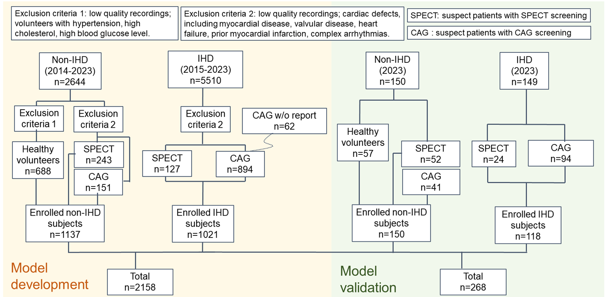
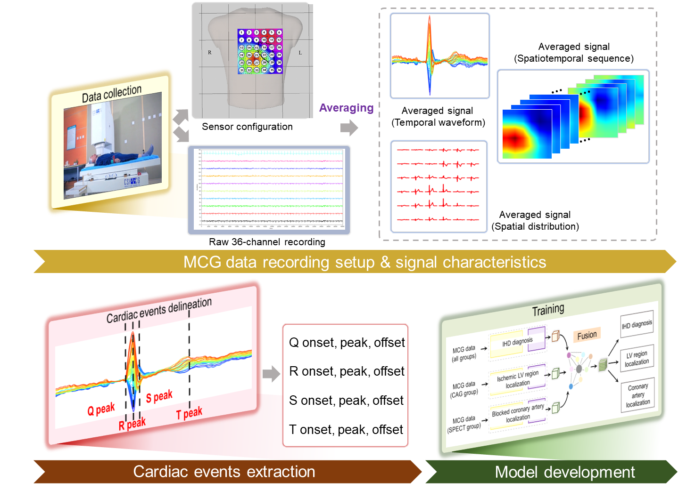
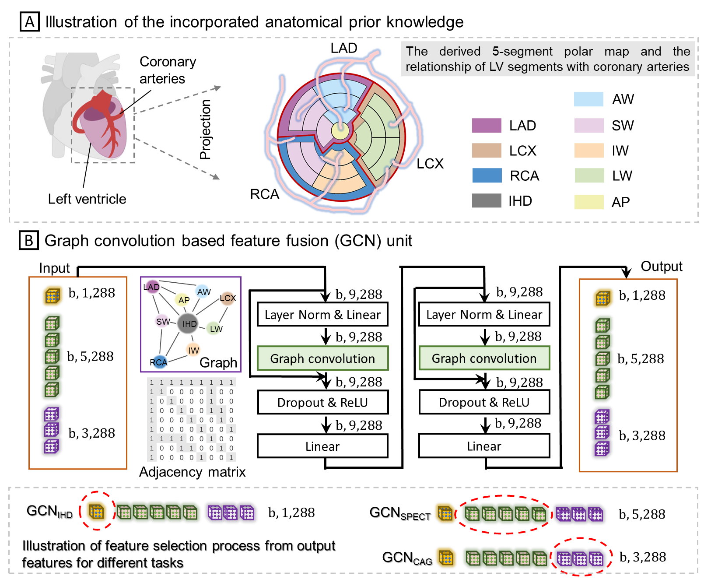
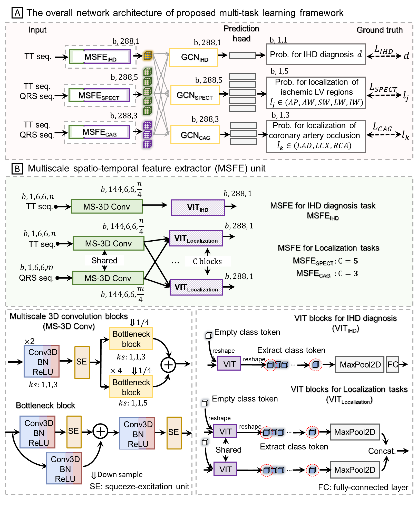
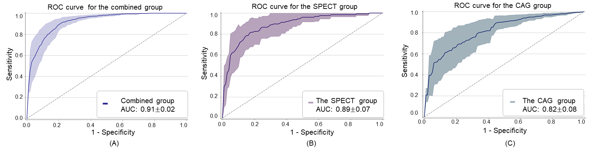

The code repository for "[AI-enabled Diagnosis and Localization of Myocardial Ischemia and Coronary Artery Occlusions from Magnetocardiographic Recordings]" in PyTorch. 

Rong Tao1,+, Shunlin Zhang2,+, Rui Zhang3, Chengxing Shen4, Jian Ma4, Jianguo Cui5,
Yundai Chen5, Bo Wang6, Hailing Li6, Xiaoming Xie2, and Guoyan Zheng1,*

1 Institute of Medical Robotics, School of Biomedical Engineering, Shanghai Jiao Tong University, Shanghai, China
2 Shanghai Institute of Microsystem and Information Technology, Chinese Academy of Sciences, Shanghai, China
3 School of Data Science, City University of Hong Kong, Hong Kong, China
4 Department of Cardiology, Shanghai Sixth People's Hospital Affiliated to Shanghai Jiao Tong University School of Medicine, Shanghai, China
5 The General Hospital of Chinese People's Liberation Army, Beijing, China
6 Department of Cardiology, Shanghai Tenth People's Hospital, Tongji University School of Medicine, China

+these authors contributed equally to this work

*corresponding author

## Main idea

Early diagnosis and localization of myocardial ischemia and coronary artery occlusions play a crucial role in the effective
prevention and management of ischemic heart disease (IHD). Magnetocardiography (MCG) has emerged as a promising
approach for non-invasive, non-contact, and high-sensitivity assessment of cardiac dysfunction. This study presents the
first AI-enabled diagnosis and localization of myocardial ischemia and coronary artery occlusions from MCG data. To this
end, we collected a large-scale dataset consisting of 2,158 MCG recordings from eight clinical centers. We then proposed a
multiscale vision transformer-based network specifically tailored for extracting spatio-temporal information from multichannel
MCG recordings. Anatomical prior knowledge of the coronary artery and the irrigated left ventricular regions was incorporated
by a carefully designed graph convolutional network (GCN)-based feature fusion module. On the development dataset, the proposed approach achieved an
average accuracy of 84.7%, an average sensitivity of 83.8%, and a specificity of 85.6% in diagnosing IHD, an average accuracy
of 78.4% in localization of five myocardial ischemic regions, and an average accuracy of 65.3% in localization of occlusion
in three coronary arteries. Subsequent validation on an independent validation dataset consisting of 268 MCG recordings
collected from four clinical centers further confirmed the efficacy of the proposed approach.

Illustration of subject enrollment process.

## Experiments and Results

**Illustration of the proposed pipeline**

**(A) Illustration of the incorporated anatomical prior knowledge, featuring the relationship between three coronary
arteries and five LV regions, (B) design of the graph convolution based feature fusion (GCN) unit and the output feature
selection process for GCN unit corresponding to IHD diagnosis (GCNIHD), localization of ischemic region (GCNSPECT ) and
localization of coronary artery occlusion (GCNCAG), respectively**

**(A) Overall network architecture design for the proposed multi-task learning framework, including IHD diagnosis,
localization of ischemic cardiac regions and localization of obstructed coronary arteries; (B) design of the multiscale
spatio-temporal feature extractor (MSFE) uint**

**IHD diagnostic ROC curves of the proposed approach when evaluated on the combined group (A), the SPECT
group (B), and the CAG group (C) of the development dataset. The mean ROC curves and standard deviation (shaded region)
are plotted for each group**

## Prerequisites

The following packages are required to run the scripts:

- [PyTorch-1.6 and torchvision](https://pytorch.org)

- Package: numpy, sklearn, timm, apex

## Code Structures
To use our project, please use **train_basic.py**,**train_basic_spect.py**,**train_basic_cta.py**, **train_gcn.py**
 - `models`: It contains the main files of the code, including the few-shot learning trainer, the dataloader, the network architectures, and baseline and comparison models.
 - `dataset`: Data loaders and splits for the data sets.
 - `*engine*.py`: train or inference loop
 - `train*.py, inference*.py`: train or inference files

## Model Evaluation
Please use **train_basic.py**,**train_basic_spect.py**,**train_basic_cta.py** to pretrain the three network branches, and **train_gcn.py** to train the final GCN model and follow the instructions below. 

## Pretrain the three network branches
The **train_basic.py**,**train_basic_spect.py**,**train_basic_cta.py** takes the following options:

- `batch_size`: default to `10`

- `epochs_init`: T-opt, default to `500`

- `data_path`: Path to preprocessed .pickle files

- `output_dir`: Path to save weight file/ log files

- `resume`: Path to pretrained weights

## Train the GCN 
The **train_GCN.py** takes the following options:

- `adjacency matrix`: `ADJ_matrix2.csv`

- `batch_size`: default to `5`

- `epochs_init`: T-opt, default to `500`

- `data_path`: Path to preprocessed .pickle files

- `output_dir`: Path to save weight file/ log files

- `resume`: Path to pretrained weights

## Inference
The **inference_gcn.py** takes the following options:

- `batch_size`: always be `1` 

- `data_path`: Path to preprocessed .pickle files

- `output_dir`: Path to save weight file/ log files

- `resume`: Path to pretrained weights

